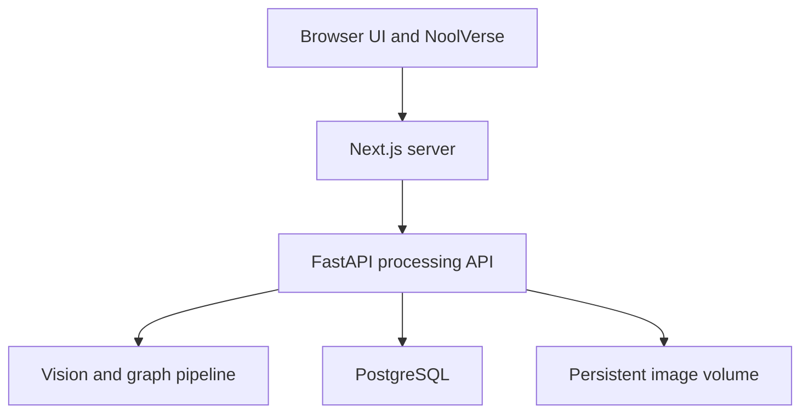

# Noolu Pidichaal Mathi — Product Requirements Document

> **Vazhi ariyille? Noolu pidichaal mathi.**  
> Don’t know the route? Just follow the noodle.

**Descriptor:** An Idiyappam Public Transportation System  
**3D world:** NoolVerse  
**Status:** Build-ready product specification  
**Target:** TinkerHub Useless Projects 3.0

## 1. Executive summary

Noolu Pidichaal Mathi converts a photograph of idiyappam into a functioning miniature public-transport network. A deterministic vision pipeline extracts visible paths. Graph algorithms convert them into lines, stations, interchanges, disruptions, and routes. A cinematic WebGL experience then reconstructs that network as NoolVerse: a layered 3D transit system hovering over the original breakfast, complete with stations, signals, tiny trains, camera modes, and an excessively bureaucratic route planner.

The concept is deliberately useless, but the implementation must be real. The audience should laugh immediately, then stare at the screen wondering why an idiyappam has better public transport than their city.

## 2. Problem and opportunity

Image demos often terminate at classification, captions, or filters. Those outputs are difficult to explore and easy to fake. Idiyappam naturally resembles an interconnected transport network, creating an unusually legible transformation:

**physical food → segmented paths → topology → metro semantics → navigable 3D world**

Every technical layer remains visible in the final experience. That makes complexity part of the entertainment instead of hidden plumbing.

## 3. Product principles

1. **The premise takes one sentence.** Upload idiyappam; get a metro system.
2. **The transformation must be provable.** Tracks remain aligned with detected noodle geometry.
3. **3D is the product.** It must feel authored, explorable, and alive rather than like a graph dropped into Three.js.
4. **Bureaucracy is the comedy.** Every warning, line name, and journey statistic treats breakfast transit as national infrastructure.
5. **Honesty remains visible.** Crossings are inferred, uncertainty is displayed, and hidden strands are never magically recovered.
6. **Spectacle cannot murder usability.** Adaptive quality, reduced motion, and 2D fallback are first-class behavior.
7. **The demo has escape hatches.** Known-good samples and preprocessed maps remain available when the venue Wi-Fi begins its funeral rites.

## 4. Goals

- Convert controlled idiyappam images into useful graph topology without manual editing.
- Make each processing stage visually understandable.
- Deliver a visually exceptional, smooth, browser-based 3D metro world on desktop and mobile.
- Support meaningful exploration, station inspection, shortest-route planning, transfer instructions, and train-following playback.
- Produce stable share links that reload without reprocessing.
- Deploy permanently on the user's Dokploy server behind Traefik.
- Permit development agents to research current documentation and acquire properly licensed visual assets.
- Use GPT-5.6 Sol for efficient implementation and GPT-6 Astra for high-complexity design, debugging, review, and integration reasoning.

These models support development; neither is required by the production image-processing or routing path.

## 5. Non-goals

- Recovering the true continuity of noodles hidden beneath crossings.
- Supporting uncontrolled food photography in the first release.
- Producing scientifically valid physical measurements.
- Operating a real public-transport service, despite management's confidence.
- Requiring a server GPU or a production LLM API.
- Live video processing, augmented reality, VR, native apps, or multiplayer.
- Accounts, payments, comments, rankings, moderation, or a public upload gallery.
- Replacing professional 3D tools with an in-browser level editor.
- Using copyrighted or ambiguously licensed third-party assets.

## 6. Actors

- **Visitor:** uploads a photo or sample and explores the generated system.
- **Shared-map viewer:** opens and explores a previously generated map.
- **Presenter:** runs a repeatable hackathon demonstration.
- **Operator:** maintains the Dokploy deployment, storage, health, and retention.
- **Developer:** implements and verifies the product using the repository workflow in `AGENTS.md`.

## 7. User stories

### 7.1 Capture and validation

1. As a visitor, I want to see a good-photo example, so that I can provide an image the system can analyze.
2. As a visitor, I want to upload a JPEG, PNG, or WebP image, so that I can map my own idiyappam.
3. As a visitor, I want immediate validation feedback, so that I can correct an unsupported, oversized, unreadable, or low-quality upload.
4. As a visitor, I want a known-good sample option, so that I can experience the product without taking a photograph.
5. As a privacy-conscious visitor, I want image metadata removed, so that unnecessary device information is not retained.

### 7.2 Analysis and reveal

6. As a visitor, I want to see named processing stages, so that the wait feels intentional and understandable.
7. As a visitor, I want the detected mask overlaid on my image, so that I can judge what the system recognized.
8. As a visitor, I want the skeleton to grow along visible noodles, so that I can see how the transit network was derived.
9. As a visitor, I want endpoints and junctions identified during the reveal, so that stations do not appear arbitrary.
10. As a visitor, I want uncertainty and disconnected fragments labeled, so that the output does not pretend to know invisible strand geometry.
11. As a presenter, I want deterministic results from identical inputs and settings, so that the live demo remains repeatable.
12. As a developer, I want pipeline versions and settings saved with each map, so that regressions can be reproduced.

### 7.3 3D exploration

13. As a visitor, I want the flat detected network to assemble into a 3D metro world, so that the transformation feels spectacular.
14. As a visitor, I want the original plate and noodles beneath the tracks, so that I can verify their alignment.
15. As a visitor, I want to orbit, pan, zoom, and reset the world, so that I can inspect it freely.
16. As a visitor, I want a top-down photo-aligned mode, so that I can compare the network with the source.
17. As a visitor, I want a cinematic flyover, so that I can watch the most impressive parts without controlling the camera.
18. As a visitor, I want to inspect a station, so that I can read its name, lines, confidence, and service status.
19. As a visitor, I want moving trains and signals, so that the network feels operational rather than decorative.
20. As a visitor, I want quality controls, so that I can trade visual effects for smoother performance.
21. As a motion-sensitive visitor, I want reduced motion, so that the reveal and camera behavior remain comfortable.
22. As a visitor without working WebGL, I want a complete 2D view, so that I can still inspect the network and plan routes.

### 7.4 Route planning

23. As a visitor, I want to choose an origin and destination in the scene, so that I can plan an unnecessary journey.
24. As a keyboard or screen-reader user, I want station selectors outside the canvas, so that route planning is accessible.
25. As a visitor, I want the best route highlighted while unrelated lines dim, so that the journey is easy to follow.
26. As a visitor, I want transfers and disruptions reflected in the route, so that the planner behaves like a serious transit system.
27. As a visitor, I want a typed no-route state, so that disconnected noodles do not create fictional directions.
28. As a visitor, I want to ride behind the Nool Express, so that route playback becomes the visual payoff.
29. As a visitor, I want pause, replay, speed, and camera controls, so that I can inspect the journey at my own pace.
30. As a visitor, I want comic route statistics, so that the product preserves its bureaucratic humor.

### 7.5 Sharing and operations

31. As a visitor, I want an unguessable share URL, so that another person can reopen my generated map.
32. As a shared-map viewer, I want the saved graph to load without analysis, so that the map opens quickly.
33. As a presenter, I want preprocessed showcase maps, so that the demonstration can survive upload or processing failure.
34. As an operator, I want separate liveness and readiness checks, so that I can distinguish process failure from dependency failure.
35. As an operator, I want structured stage timings, so that I can locate slow processing and rendering inputs.
36. As an operator, I want expired images and maps removed together, so that storage remains bounded.
37. As an operator, I want private internal services, so that only the intended web entry point is exposed.
38. As an operator, I want production deployed from verified `main`, so that the public site matches reviewed code.

## 8. End-to-end experience

### 8.1 Landing

- Show the name, Manglish tagline, one-sentence premise, upload action, and sample action above the fold.
- Use a small looping preview of the scan-to-metro transformation.
- Present four photo rules: top-down, even light, contrasting plate, visible noodles.
- State the retention period near the upload control.

### 8.2 Processing theatre

The interface communicates real stages rather than inventing fake progress percentages:

1. **Inspection:** decode, orient, validate, and crop.
2. **Nool isolation:** segment and clean the mask.
3. **Route survey:** skeletonize and detect topology.
4. **Transit planning:** build graph, assign lines, stations, statuses, and names.
5. **Urban development:** send the graph and assemble NoolVerse.

Each completed stage leaves a visual layer available for later inspection. Failure identifies the stage and offers a practical correction plus a sample fallback.

### 8.3 NoolVerse reveal

- Begin with the normalized photograph aligned top-down.
- Sweep a scanner shader across the plate.
- Grow a cyan skeleton along ordered edge points.
- Pulse terminal and junction candidates.
- Extrude ivory noodle geometry and colored rails from the plate.
- Lift lines into assigned levels and grow station supports downward.
- Assemble interchange rings, platforms, signals, and service barricades.
- Tilt the camera into perspective, fade in the environment, and start ambient train movement.
- End with an immediately actionable “Choose two stations” prompt.

### 8.4 Exploration and journey

- The default camera frames the largest component and preserves a visible plate edge.
- Station selection works through raycasting and accessible external controls.
- Once a route exists, animate a pulse from origin to destination before launching the train.
- Train movement samples distance along a continuous curve for constant apparent speed.
- Camera transitions use collision-safe authored offsets rather than uncontrolled scene navigation.
- The journey card lists stations, line colors, transfers, warnings, total cost, and intentionally fake noodle units.

## 9. Functional requirements

### FR-1 Upload safety

- Validate byte count before full processing.
- Verify MIME type from decoded content, not only extension or request headers.
- Limit decoded dimensions and processing duration.
- Strip metadata and ignore the client filename for storage.
- Never return internal file paths.

### FR-2 Segmentation

- Normalize color and contrast conservatively.
- Support adaptive and Otsu threshold strategies through versioned settings.
- Apply configurable morphology, small-object removal, and hole filling.
- Reject masks outside acceptable foreground-coverage bounds.
- Preserve a low-resolution diagnostic mask for the reveal.

### FR-3 Skeleton and graph extraction

- Skeletonize the cleaned binary mask.
- Calculate eight-neighbor connectivity.
- Classify degree-one pixels as endpoints and degree-three-or-more regions as junction candidates.
- Cluster adjacent candidate pixels into stable logical nodes.
- Trace each edge exactly once as an ordered polyline between nodes.
- Preserve component, pixel length, confidence, and diagnostic reasons.
- Prune short spurs according to persisted settings.
- Simplify visual geometry within a bounded deviation from the detected path.

### FR-4 Metro semantics

- Convert useful endpoints and junctions into stations.
- Insert intermediate stations on long edges when needed for interaction.
- Pair the most collinear edges into continuing lines.
- Assign remaining branches to additional lines.
- Limit active line count to a readable palette and merge insignificant fragments where justified.
- Assign each line a color, name, elevation level, and service state.
- Mark small disconnected components as suspended services.
- Persist random seeds or generated labels so reloads are stable.

### FR-5 Routing

- Use a weighted graph over persisted nodes and edges.
- Use Dijkstra pathfinding for the first release.
- Combine visible edge length, transfer penalty, and disruption penalty.
- Return ordered nodes, edges, line transitions, total cost, display distance, and warnings.
- Return a typed no-route result rather than an unhandled error.

### FR-6 3D world construction

- Normalize source image coordinates into one consistent world coordinate system.
- Render the plate and aligned source texture as the ground truth layer.
- Convert edge polylines to smoothed curves without moving them beyond the accepted visual tolerance.
- Render a subtle ivory noodle layer and a brighter metro layer from related curves.
- Use discrete elevation levels and vertical interchange connectors.
- Generate terminals, platforms, supports, signals, tunnels, barriers, and station halos from reusable instanced components.
- Support reveal progress through shader uniforms or geometry draw ranges.
- Load downloaded assets through a central asset manifest with fallbacks.

### FR-7 Trains and animation

- Place ambient trains only on suitable active lines.
- Sample train position and tangent by normalized distance along curves.
- Orient train models from the path tangent and stable up vector.
- Pause ambient motion during selected-route playback where visual conflict occurs.
- Keep animation state separate from the persisted transport graph.
- Disable or simplify nonessential motion in reduced-motion and lower-quality modes.

### FR-8 Camera and controls

- Implement orbit, top view, cinematic, train cam, and photo-aligned modes.
- Smoothly transition between known camera poses.
- Provide reset and escape actions.
- Prevent zooming inside the plate or losing the scene completely.
- Keep all route actions available outside the WebGL canvas.

### FR-9 Persistence

- Persist the graph contract, source-image reference, processing settings, pipeline version, schema version, visual seed, stable names, statistics, timestamps, and expiry.
- Save the normalized image on a mounted volume, not in a container layer.
- Use unguessable map IDs.
- Delete expired rows and matching images through an idempotent cleanup operation.

## 10. Visual direction

### 10.1 Style

The interface should feel like a premium transit control room built by people who have catastrophically misunderstood the importance of breakfast.

- Deep graphite background and warm ivory food tones.
- Coral, turmeric yellow, electric cyan, mint, and violet transit lines.
- Restrained frosted panels with crisp typography and large map area.
- Ceramic, translucent noodle, enamel, metal, and emissive-glass materials.
- Warm environmental lighting contrasted with cool analytical overlays.
- Sparse labels; selected and important stations receive priority.

### 10.2 Required scene objects

- Ceramic plate and aligned source image.
- Procedural noodle/track curves.
- Elevated rail levels and structural supports.
- Terminal, normal-station, and interchange geometries.
- Low-poly train with emissive windows.
- Signals, suspended-service barrier, congestion halo, and route pulse.
- World-space labels for major stations plus screen-space accessible details.

### 10.3 Effects hierarchy

Effects are applied in this order of importance:

1. Clean antialiasing and correct color management.
2. Stable lighting and readable materials.
3. Route and station emissive cues.
4. Selective bloom.
5. Contact shadows or baked ambient occlusion.
6. Fog, particles, vignette, and cinematic extras.

When performance drops, disable from the bottom upward.

## 11. Rendering architecture

### 11.1 Client scene modules

| Module | Responsibility |
|---|---|
| `MetroWorld` | Scene lifecycle, quality tier, normalized coordinates |
| `PlateGround` | Plate mesh, source texture, scan surface |
| `NoodleGeometry` | Ivory source-path tubes or height representation |
| `RailNetwork` | Batched colored lines and elevation transitions |
| `StationInstances` | Repeated terminals, stations, supports, and signals |
| `InterchangeHub` | Multi-level connector and selected-state treatment |
| `TrainSystem` | Ambient and selected-route train movement |
| `RouteEffects` | Highlight, dimming, route pulse, disruptions |
| `CameraDirector` | Orbit, top, cinematic, train, and photo-align modes |
| `MapInterface` | Accessible selectors, route card, settings, fallback |

### 11.2 Geometry strategy

- Simplify polylines server-side and smooth them client-side with bounded curves.
- Prefer batched strip or tube geometry grouped by line/material.
- Use instancing for repeated mesh classes.
- Share materials and textures; do not clone them per graph object.
- Use level-of-detail variants for downloaded train and prop models.
- Dispose all map-specific GPU resources when changing maps.

### 11.3 Adaptive quality

- Detect approximate device capability during initialization.
- Begin conservatively on mobile.
- Measure sustained frame time after scene stabilization.
- Adjust DPR, particles, shadow mode, post-processing, and prop density with hysteresis to prevent constant toggling.
- Persist the visitor's manual override locally.
- Fall back to 2D after repeated WebGL context failure.

## 12. System architecture

- FastAPI owns image validation, vision, graph construction, and routing.
- Next.js owns the product interface, shared-map pages, and browser rendering.
- The browser owns scene construction and animation from immutable API graph data.
- PostgreSQL stores validated JSONB for fast schema evolution during the hackathon.
- A queue is introduced only after measured concurrency or duration requires it.

## 13. Public contracts

### 13.1 Endpoints

| Method | Path | Success behavior |
|---|---|---|
| `POST` | `/api/maps` | `201` with map ID, graph summary, and share URL |
| `GET` | `/api/maps/{id}` | `200` with versioned graph and presentation data |
| `POST` | `/api/maps/{id}/route` | `200` with ordered route or typed no-route result |
| `GET` | `/api/maps/{id}/image` | `200` with the normalized image under safe cache rules |
| `GET` | `/health/live` | `200` when the process is alive |
| `GET` | `/health/ready` | `200` only when required dependencies are usable |

### 13.2 Graph entities

- **Map:** ID, schema version, pipeline version, image dimensions, settings, visual seed, statistics, creation, and expiry.
- **Node:** ID, normalized/image coordinates, kind, name, confidence, component, line memberships, and service state.
- **Edge:** ID, endpoint IDs, ordered points, visible length, line ID, component, confidence, status, and elevation transitions.
- **Line:** ID, name, color, level, service state, and ordered edge membership.
- **Route:** ordered node/edge/line IDs, transfers, weighted cost, display distance, warnings, and animation path.

The renderer consumes normalized coordinates derived from stored image-space coordinates. Breaking schema changes require a new version and either deliberate migration or backward-compatible decoding.

## 14. Data storage

| Field | Type | Purpose |
|---|---|---|
| `id` | ULID or UUID | Unguessable public identity |
| `schema_version` | integer | API graph compatibility |
| `pipeline_version` | string | Vision reproducibility |
| `image_path` | string | Volume-relative normalized image path |
| `image_width`, `image_height` | integer | Coordinate normalization |
| `settings` | JSONB | Threshold and graph parameters |
| `graph` | JSONB | Validated nodes, edges, lines, and stats |
| `visual_seed` | integer | Stable procedural presentation |
| `created_at`, `expires_at` | timestamp | Lifecycle and retention |

## 15. Asset acquisition and provenance

Development agents may browse current official documentation and download visual assets when useful. Every acquired asset must satisfy all of the following:

- CC0/public-domain preferred; otherwise a clearly documented compatible license.
- Original source and license page verified at download time.
- No hotlinking; production assets are stored and served locally.
- No executable files from untrusted archives.
- Source URL, creator, license, date, and modifications recorded in `ASSET_LICENSES.md`.
- Texture dimensions, channels, color space, and compression validated.
- 3D models inspected for excessive polygons, animations, hidden objects, and unused materials.
- Runtime copies optimized to WebP/AVIF, KTX2/Basis, or GLB with Meshopt/Draco where appropriate.
- Each optional asset has a procedural or local fallback so its absence cannot break the application.

Asset research and license recording belong in the same atomic commit as the asset introduction.

## 16. Performance requirements

| Metric | Requirement |
|---|---|
| Upload-to-map | p95 ≤ 10 seconds on the Dokploy host for controlled inputs |
| Saved-map API | p95 ≤ 500 ms on the deployment network |
| Target laptop | Stable 60 FPS in Balanced mode |
| Mid-range phone | Stable ≥30 FPS in the selected tier |
| Client graph | ≤10,000 simplified points by default |
| Initial app assets | <5 MB compressed target; 8 MB hard review threshold |
| Long task blocking | No routine main-thread task over 50 ms after scene load |

Performance is measured on production builds, not development mode. A pretty screenshot at 4 FPS is a hostage situation, not a finished feature.

## 17. Accessibility

- All upload, view, station, route, playback, and quality controls must be reachable outside the canvas.
- Use semantic labels, visible focus, sufficient contrast, useful error text, and keyboard order.
- Announce route results and processing failures through appropriate live regions.
- Respect `prefers-reduced-motion` and provide an explicit motion control.
- Provide captions or non-audio equivalents for all sound cues.
- Maintain the complete 2D route-planning fallback.

## 18. Security and privacy

- Apply byte, pixel, request-rate, and processing-time limits before expensive work.
- Decode uploads using maintained image libraries in a restricted path.
- Never trust client filenames, MIME claims, graph IDs, or route node IDs.
- Prevent path traversal and avoid serving arbitrary volume files.
- Do not log images, secrets, full user agents, or sensitive metadata.
- Keep PostgreSQL and optional Redis private to the Dokploy network.
- Store secrets only through deployment configuration.
- Display and enforce the map retention policy.

## 19. Observability

- Emit structured logs containing request ID, map ID, pipeline stage, duration, outcome, and stable error code.
- Record decode, segmentation, skeletonization, extraction, persistence, API, and client scene-initialization timing.
- Track rejected uploads, processing failures, WebGL fallback rate, selected quality tier, and route failures without collecting image contents.
- Make misconfiguration fail readiness with a specific operator-facing log message.

## 20. Test strategy

### 20.1 Backend

- Unit-test validation, segmentation helpers, node classification, junction clustering, edge tracing, pruning, line assignment, and route cost.
- Maintain licensed golden-image fixtures covering clean, borderline, disconnected, and invalid cases.
- Assert topology invariants and bounded tolerances instead of exact every-pixel equality where dependencies may differ.
- Test the public upload-to-persistence-to-retrieval and saved-map-to-route seams.
- Test retention cleanup against database rows and actual files.

### 20.2 Frontend and 3D

- Test schema decoding, map state, selectors, route directions, quality switching, reduced motion, and 2D fallback.
- Use fixed graph fixtures for deterministic UI and geometry tests.
- Assert geometry counts, finite positions, bounded coordinates, route alignment, and resource disposal.
- Use visual-regression snapshots for landing, processing layers, default scene, selected route, and fallback.
- Profile one dense acceptance graph on the target laptop and phone.

### 20.3 End to end

- Upload a known image, observe all real stages, open NoolVerse, select stations, calculate a route, run train cam, copy the share URL, reload it, and repeat after container replacement.
- Test unsupported input, processing failure, disconnected route, missing WebGL, and reduced-motion paths.

Tests should prefer public seams. Mock only genuinely external, unreliable, or expensive boundaries and keep representative contract fixtures synchronized with reality.

## 21. Dokploy requirements

- Use the exact repository supplied by the user; never create or substitute a remote.
- Build checked-in Docker/Compose configuration from verified `main`.
- Route the web entry point through Traefik at `idiyappam.midhunpm.in` unless changed by the user.
- Keep the API, database, optional queue, and storage management private.
- Persist PostgreSQL and the normalized upload volume.
- Configure `DATABASE_URL`, `PUBLIC_BASE_URL`, `UPLOAD_DIR`, `MAX_UPLOAD_BYTES`, and `RETENTION_DAYS` in Dokploy.
- Never commit production secrets.
- Treat deployment as successful only after public health checks and a real image-to-route smoke test pass.

## 22. Risks and mitigations

| Risk | Mitigation |
|---|---|
| Thick noodle regions merge into blobs | Controlled photo guide, parameter presets, distance-transform experiments, known-good samples |
| Crossings produce fictional connectivity | Visible confidence and “inferred interchange” semantics |
| Raw topology becomes visual spaghetti | Junction clustering, spur pruning, line limit, simplification, elevation assignment |
| 3D overwhelms mobile GPUs | Adaptive tiers, instancing, batched geometry, compressed assets, 2D fallback |
| Downloaded assets create legal or size debt | License ledger, local hosting, optimization budget, procedural fallbacks |
| Reveal is fake or stalls | Real stage events, precomputed display artifacts, timeouts, sample escape hatch |
| Venue connectivity fails | Locally served assets and preprocessed sample maps |
| Storage grows forever | Tested database-and-file retention job |
| Containers run but production is broken | Dependency readiness and external post-deploy smoke tests |

## 23. Delivery sequence

1. **Vertical slice:** one fixture → graph → persisted map → 2D route.
2. **Vision reliability:** validation, topology cleanup, golden images, diagnostics.
3. **3D foundation:** plate, coordinate alignment, rails, stations, orbit/top cameras.
4. **Insane layer:** procedural structures, scan reveal, trains, train cam, effects, quality tiers.
5. **Product shell:** upload UX, naming, accessible controls, saved maps, share links, samples.
6. **Production:** security limits, retention, Docker, Dokploy, Traefik, health, smoke tests.
7. **Demo hardening:** target-device profiling, visual regression, three full rehearsals.

Each sequence item is a big change and therefore receives its own feature branch and pull request under `AGENTS.md`.

## 24. Release acceptance

Release is accepted only when the full MVP definition of done passes, known limitations appear honestly in the interface, NoolVerse stays usable on the target laptop and phone, all third-party assets have verified provenance, share links survive redeployment, and the public experience runs while the development laptop is switched off.

