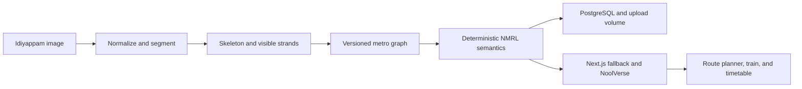

# Noolu Pidichaal Mathi 🎯

> **Vazhi ariyille? Noolu pidichaal mathi.**

## Basic Details

### Team Name: Popcorn

### Team Members

- Team Lead: Midhun P M — Sahrdaya College of Engineering

### Project Description

Noolu Pidichaal Mathi turns an idiyappam photograph into an absurdly official
metro network. It extracts visible strands, reveals the intermediate skeleton,
builds a deterministic graph, and lets a visitor plan a journey through
**NoolVerse**, the 3D world of NMRL — Noolu Metro Rail Limited.

### The Problem (that doesn't exist)

Breakfast has no reliable public transport. A passenger at Kottayam Kappa
Connection cannot reach Kozhi-Code Red Chutney before the sambar gets cold.

### The Solution (that nobody asked for)

We promote visible idiyappam paths to public infrastructure. The app reveals the
source image, skeleton, chosen paths, graph, stations, routes, trains, and a
fictional NMRL timetable. Crossings a single photo cannot prove remain inferred.

## Technical Details

### Technologies/Components Used

For Software:

- TypeScript, Python, SQL
- Next.js, React, FastAPI, PostgreSQL
- React Three Fiber, Drei, Three.js
- OpenCV, scikit-image, NumPy, SQLAlchemy, asyncpg
- pnpm, uv, Vitest, pytest, Ruff, mypy, Docker Compose, Dokploy

For Hardware:

- No dedicated hardware. Image processing runs in FastAPI; NoolVerse uses a
  WebGL-capable browser with a usable 2D fallback.

### Implementation

The pipeline normalizes an uploaded image, segments visible noodle regions,
skeletonizes them, extracts a versioned graph, assigns deterministic NMRL
semantics, and persists the result. The Next.js client stages source → skeleton
→ selected metro paths before entering the 3D explorer. Timetables and
announcements are labelled as fictional IST simulation data, never KMRL advice.

For Software:

# Installation

```bash
pnpm install
cd apps/api && uv sync
```

# Run

```bash
# Terminal 0 — PostgreSQL with retained local data
docker compose -f compose.dev.yml up -d postgres

# Terminal 1 — web app
pnpm --filter @noolu/web dev

# Terminal 2 — API
cd apps/api
cp .env.example .env
uv run alembic upgrade head
uv run uvicorn app.main:app --reload
```

# Verify

```bash
pnpm --filter @noolu/web check
pnpm --filter @noolu/web test
pnpm --filter @noolu/web build
cd apps/api && uv run ruff check app tests && uv run mypy && uv run pytest
```

### Project Documentation

For Software:

Read the [Kerala city-name and timetable policy](docs/city-names.md) for the
deterministic naming rules and the distinction between NMRL jokes and real
transport information.

# Screenshots (Add at least 3)

Real runtime captures will be stored in `docs/screenshots/`:

1. Upload and progressive source → skeleton → metro reveal.
2. Expanded source, skeleton, and source-aligned chosen-path evidence.
3. NoolVerse route, labelled stations, map layers, train, and NMRL timetable.

No concept art or mock images are passed off as product screenshots. The
[screenshot manifest](docs/screenshots/README.md) records the required captures.

# Diagrams



For Hardware:

# Schematic & Circuit

Not applicable: this is a software-only breakfast transit authority.

# Build Photos

Not applicable: the only construction material is idiyappam topology.

### Project Demo

# Video

Live demo: [idiyappam.midhunpm.in](https://idiyappam.midhunpm.in)

# Additional Demos

- [Repository](https://github.com/9MidhunPM/NooluPidichaalMathii)
- [Kerala station naming and fictional timetable policy](docs/city-names.md)

## Team Contributions

- **Midhun P M:** product direction, visual system, deterministic image-to-graph
  pipeline, API, frontend, 3D explorer, testing, deployment, and documentation.

---

Made with ❤️ at TinkerHub Useless Projects


