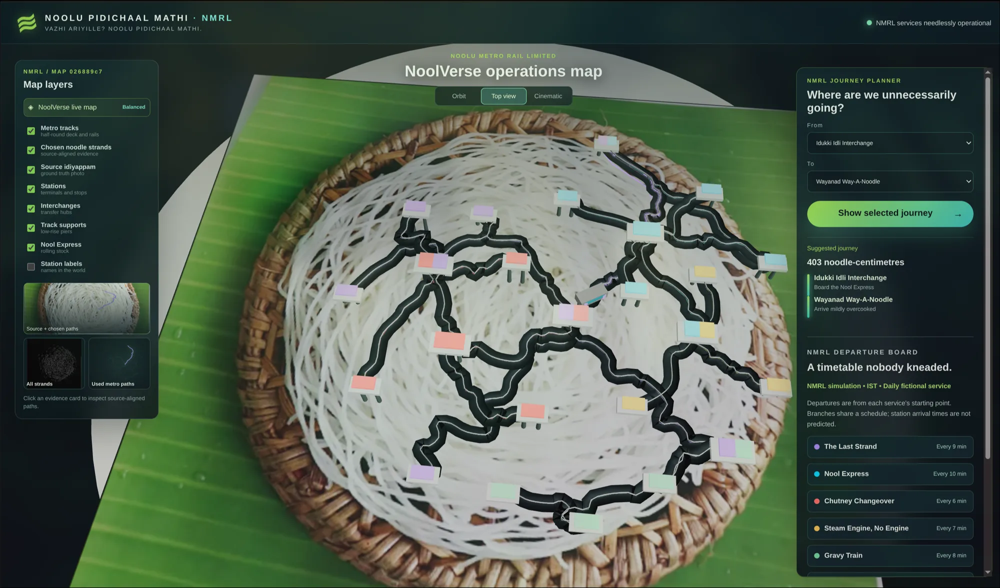
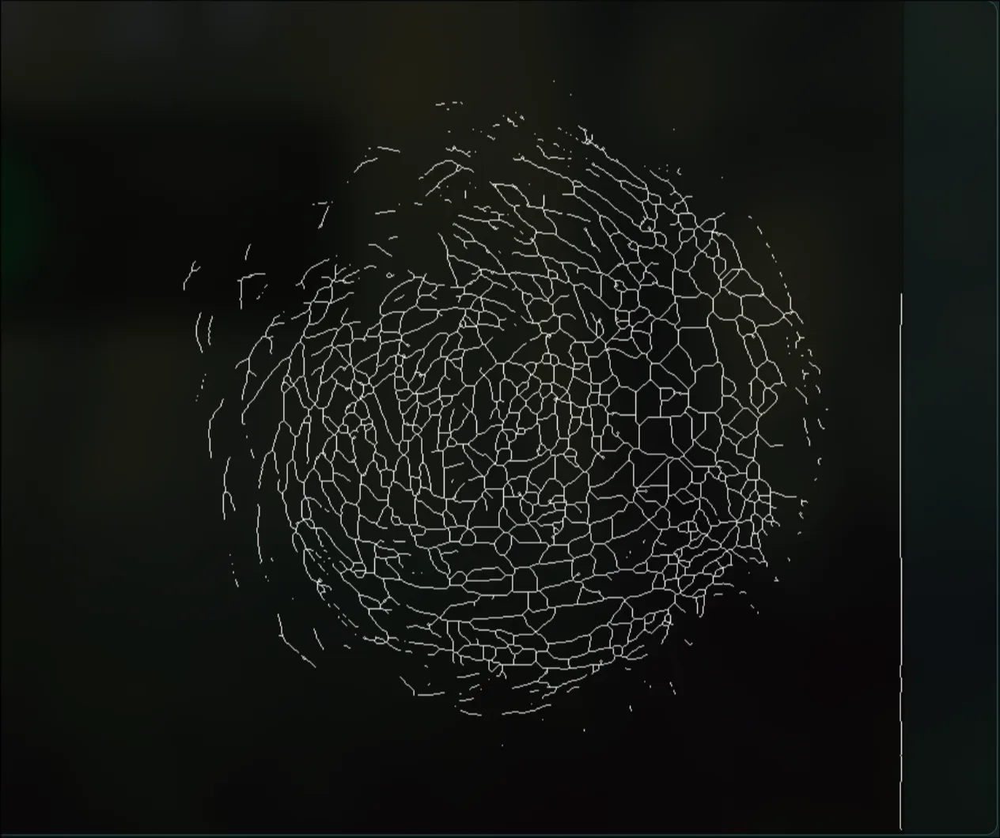
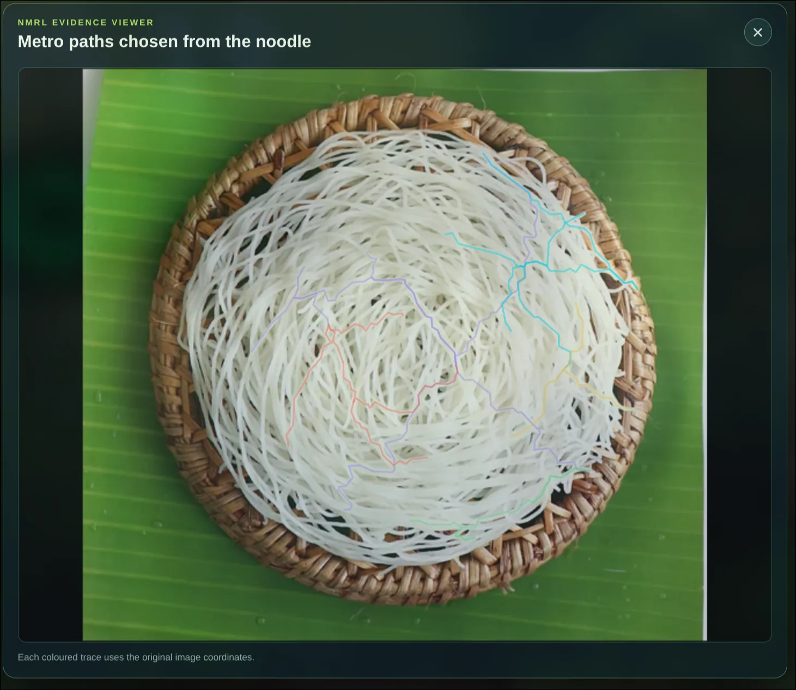
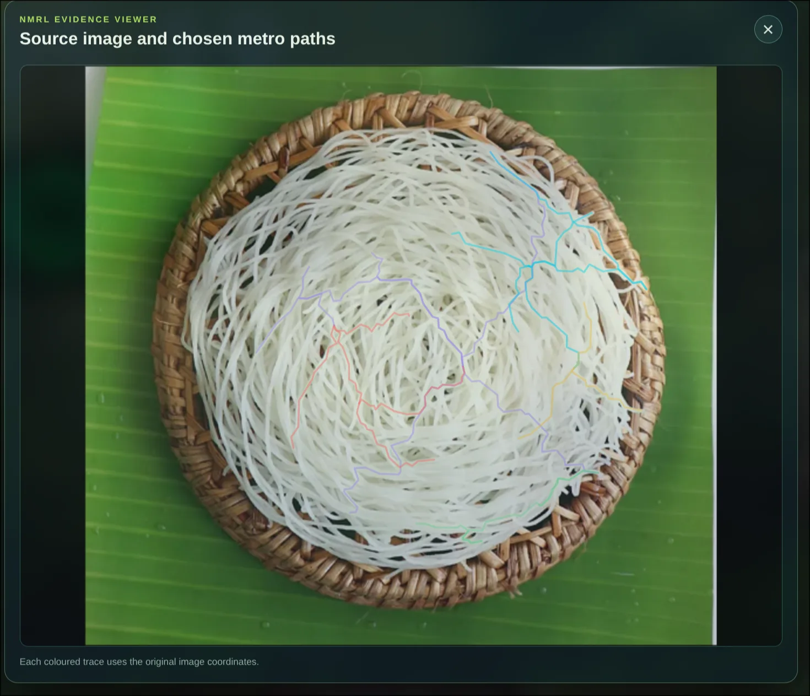
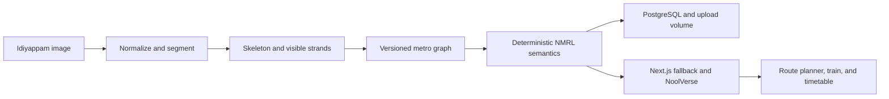

# Noolu Pidichaal Mathi — NMRL: Noolu Metro Rail Limited 🎯

> **Vazhi ariyille? Noolu pidichaal mathi.**

> **NMRL official motto:** *From noodles to new horizons, one suspiciously
> well-connected breakfast at a time.*

## Basic Details

### Team Name: Popcorn

### Team Members

- Team Lead: Midhun P M — Sahrdaya College of Engineering

### Project Description

Noolu Pidichaal Mathi turns an idiyappam photograph into an absurdly official
metro network. It extracts visible strands, reveals the intermediate skeleton,
builds a deterministic graph, and lets a visitor plan a journey through
**NoolVerse**, the 3D world of NMRL — Noolu Metro Rail Limited.

### Official Passenger Advisory

Please keep all coconut, chutney, and existential doubts behind the yellow
turmeric line. NMRL is the only metro authority whose network map begins as
breakfast and whose delays are measured in noodle-centimetres.

### The Problem (that doesn't exist)

Breakfast has no reliable public transport. A passenger at Kottayam Kappa
Connection cannot reach Kozhi-Code Red Chutney before the sambar gets cold.

### The Solution (that nobody asked for)

We promote visible idiyappam paths to public infrastructure. The app reveals the
source image, skeleton, chosen paths, graph, stations, routes, trains, and a
fictional NMRL timetable. Crossings a single photo cannot prove remain inferred.

### Why NMRL deserves absolutely no funding

- **Evidence before elevation:** every selected rail begins on a visible noodle
  path, because even imaginary infrastructure needs receipts.
- **A transport system with carbs:** routes get coloured services, Kerala-city
  breakfast puns, interchange roofs, a tiny Nool Express, and public notices
  written by somebody who has spent too long near sambar.
- **Serious software, unserious destination:** OpenCV, graph routing, and a 3D
  explorer do the work; the final stop is emotional support chutney.

## Technical Details

### Technologies/Components Used

For Software:

- TypeScript, Python, SQL
- Next.js, React, FastAPI, PostgreSQL
- React Three Fiber, Drei, Three.js
- OpenCV, scikit-image, NumPy, SQLAlchemy, asyncpg
- pnpm, uv, Vitest, pytest, Ruff, mypy, Docker Compose, Dokploy

For Hardware:

- No dedicated hardware. Image processing runs in FastAPI; NoolVerse uses a
  WebGL-capable browser with a usable 2D fallback.

#### NMRL technical operations manual

| NMRL division | Real system behind the joke | What it does before breakfast gets cold |
| --- | --- | --- |
| **Image Intake Depot** | FastAPI + Pillow | Validates JPEG/PNG/WebP uploads, strips metadata, bounds dimensions, and normalizes the image. |
| **Visible Strand Authority** | OpenCV + scikit-image + NumPy | Segments the idiyappam, cleans the mask, and produces the one-pixel skeleton shown to passengers. |
| **Track Allocation Board** | Deterministic topology extraction | Clusters endpoints and junctions, traces ordered polylines, preserves components, and refuses to invent hidden noodle continuity. |
| **NMRL Naming Committee** | Seeded metro semantics | Assigns stable Kerala breakfast-city station names, line colours, service states, and elevation levels without asking an LLM for directions. |
| **Journey Department** | Weighted graph routing | Calculates routes across persisted nodes and edges, including route warnings when the noodles simply do not connect. |
| **NoolVerse Works** | Next.js + React Three Fiber + Three.js | Builds the source-aligned plate, rails, stations, labels, train, layer controls, evidence views, and camera modes in the browser. |
| **Archive and Operations** | PostgreSQL + Docker Compose + Dokploy | Persists validated graph JSON and images, serves health endpoints, and keeps NMRL unnecessarily operational on the public web. |

### Implementation

The pipeline normalizes an uploaded image, segments visible noodle regions,
skeletonizes them, extracts a versioned graph, assigns deterministic NMRL
semantics, and persists the result. The Next.js client stages source → skeleton
→ selected metro paths before entering the 3D explorer. Timetables and
announcements are labelled as fictional IST simulation data, never KMRL advice.

#### How breakfast gets a transport department

1. **Boarding:** upload a clear, mostly top-down idiyappam photo, or use the
   official NMRL demo breakfast when the photographer has missed the train.
2. **Track extraction:** OpenCV finds visible noodle regions and reduces them to
   a one-pixel skeleton. The skeleton is shown before the rails arrive, because
   trust is the first class of travel.
3. **Network approval:** deterministic graph logic chooses nodes, routes,
   colours, elevations, and distinctly unreasonable station names.
4. **NoolVerse:** the chosen paths become rails above the original image. Pick
   two stations, light the route, and watch the Nool Express make a gravy train
   of it.

#### The route from photo to public infrastructure

```text
idiyappam photo
  → validation + normalization
  → foreground segmentation
  → cleaned binary mask
  → one-pixel skeleton
  → endpoints, junctions, and ordered visible edges
  → versioned metro graph
  → stable NMRL lines, stations, elevations, and puns
  → route planner + NoolVerse 3D metro
```

Tracks follow visible image geometry. Where a photograph cannot establish which
noodle continues under a crossing, NMRL marks an inference instead of appointing
itself Minister of Pasta Certainty.

#### Service conditions

NMRL timetable times, journey lengths, service alerts, and platform
announcements are fictional entertainment data. The app does not operate a real
metro, sell tickets, or guarantee that a train will wait while you fetch more
coconut milk.

For Software:

# Installation

```bash
pnpm install
cd apps/api && uv sync
```

# Run

```bash
# Terminal 0 — PostgreSQL with retained local data
docker compose -f compose.dev.yml up -d postgres

# Terminal 1 — web app
pnpm --filter @noolu/web dev

# Terminal 2 — API
cd apps/api
cp .env.example .env
uv run alembic upgrade head
uv run uvicorn app.main:app --reload
```

# Verify

```bash
pnpm --filter @noolu/web check
pnpm --filter @noolu/web test
pnpm --filter @noolu/web build
cd apps/api && uv run ruff check app tests && uv run mypy && uv run pytest
```

### Project Documentation

For Software:

Read the [Kerala city-name and timetable policy](docs/city-names.md) for the
deterministic naming rules and the distinction between NMRL jokes and real
transport information.

# Screenshots (Add at least 3)

These are real captures from the deployed demo using the known-good idiyappam
image. No concept art is presented as product evidence.

### NoolVerse route and operations



The source photograph remains under the rails while the explorer exposes map
layers, camera modes, journey controls, a calculated route, and fictional NMRL
departures in one interactive view. The planned path glows; the rest of the
network politely stops pretending it is the main character.

### From visible strands to selected metro paths

<p align="center">
  
  
</p>

### Source-aligned evidence



The [screenshot manifest](docs/screenshots/README.md) records capture dimensions,
provenance, and what each image verifies. In other words: no random spaghetti
architecture was harmed in the making of this metro.

# Diagrams



For Hardware:

# Schematic & Circuit

Not applicable: this is a software-only breakfast transit authority.

# Build Photos

Not applicable: the only construction material is idiyappam topology.

### Project Demo

# Video

Watch the NMRL inaugural service:
[Noolu Pidichaal Mathi demo recording](https://drive.google.com/file/d/1rwYPr8LkjTjSmfGVUpbbirlhuR85sfRH/view?usp=sharing)

The recording follows the complete NMRL premise: a real idiyappam becomes
visible computer-vision evidence, then a coloured metro network, then a
routeable NoolVerse where a train takes breakfast infrastructure far too
seriously.

Live demo: [idiyappam.midhunpm.in](https://idiyappam.midhunpm.in)

### Five-stop demo journey

1. Open the site and click **Use the official NMRL demo breakfast**.
2. Watch the source image hold its ground while the system processes it.
3. Inspect the OpenCV skeleton, then the coloured metro paths it selected.
4. Enter NoolVerse, enable labels if you want the full Kerala breakfast atlas,
   and choose any two stations.
5. Press **Show selected journey**. The route glows, the Nool Express rolls,
   and the service board tells you exactly when a fictional train will not be
   late for a very real breakfast.

# Additional Demos

- [Repository](https://github.com/9MidhunPM/NooluPidichaalMathii)
- [Kerala station naming and fictional timetable policy](docs/city-names.md)
- [NMRL inaugural service recording](https://drive.google.com/file/d/1rwYPr8LkjTjSmfGVUpbbirlhuR85sfRH/view?usp=sharing)

## Team Contributions

- **Midhun P M:** product direction, visual system, deterministic image-to-graph
  pipeline, API, frontend, 3D explorer, testing, deployment, and documentation.

---

Made with ❤️ at TinkerHub Useless Projects


